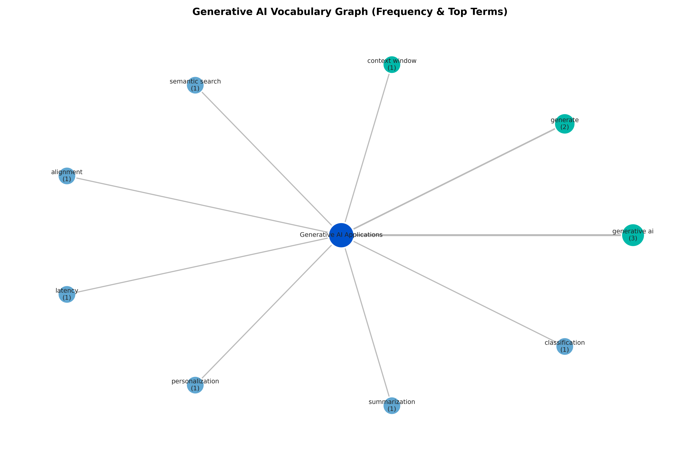

# 📘 Generative AI Applications — Research Project  


### *Use Cases, Vocabulary Analytics, Automated Graph Generation*

This project presents a complete analytical workflow around Generative AI, including a curated vocabulary, usage frequency analysis, and an automatically generated relationship graph using GitHub Actions. It demonstrates research skills, Python text processing, visualization, and automation practices.

---

## 📂 Project Structure

### ✔ research.md  
A detailed research report describing modern applications of Generative AI: business value, real-world examples, technical challenges, and opportunities.

### ✔ vocabulary.md  
A manually created vocabulary of 35+ key Generative AI terms and verbs with clear definitions.

### ✔ stats.py  
A Python script that:
- extracts vocabulary terms,
- scans the research report,
- counts usage frequency,
- generates usage_stats.json,
- creates vocab_graph.png (relationship graph).

---

## 🤖 GitHub Actions Automation  
Workflow: `.github/workflows/generate_graph.yml`

The workflow runs:
- on every push to the main branch,
- or manually via “Run workflow”.

Workflow steps:
1. Check out the repository  
2. Set up Python  
3. Install dependencies  
4. Execute stats.py  
5. Commit updated files:
   - vocab_graph.png  
   - usage_stats.json  

### Benefits:
- reproducibility  
- CI/CD automation  
- seamless Python + GitHub integration  
- always up-to-date analytics  

---

## 📊 Generated Outputs

### 1️⃣ Vocabulary Relationship Graph  
Automatically generated visualization:



## 📊 Word Usage Statistics (Auto-Generated)

The following table shows how frequently each vocabulary term appeared in the research report.

| Term | Count |
|------|-------|
| generative ai | 3 |
| generate | 2 |
| context window | 1 |
| semantic search | 1 |
| alignment | 1 |
| latency | 1 |
| personalization | 1 |
| summarization | 1 |
| classification | 1 |
| large language model | 0 |
| foundation model | 0 |
| embeddings | 0 |
| tokenization | 0 |
| prompt engineering | 0 |
| chain of thought | 0 |
| few-shot learning | 0 |
| zero-shot learning | 0 |
| hallucination | 0 |
| rag (retrieval-augmented generation) | 0 |
| vector database | 0 |
| diffusion model | 0 |
| fine-tuning | 0 |
| inference | 0 |
| gpu acceleration | 0 |
| multimodal model | 0 |
| model drift | 0 |
| knowledge base | 0 |
| parsing | 0 |
| grounding | 0 |
| api endpoint | 0 |
| safety guardrails | 0 |
| function calling | 0 |
| orchestration | 0 |
| optimization | 0 |
| evaluate | 0 |
| monitor | 0 |
| retrieve | 0 |
| transform | 0 |
| validate | 0 |


## 🚀 Run Locally

```bash
pip install -r requirements.txt
python stats.py
